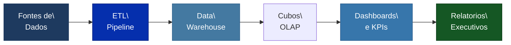

# IBM Business Intelligence Capstone

<div align="center">


[](Dockerfile)

**[PT-BR](#sobre-o-projeto) | [English](#about-the-project)**

</div>

---

<a name="sobre-o-projeto"></a>

## Sobre o Projeto

> Projeto Capstone do certificado profissional **IBM Business Intelligence (BI) Analyst** no [Coursera](https://www.coursera.org/)

Este projeto implementa uma solucao completa de Business Intelligence, incluindo Data Warehouse (modelagem dimensional), pipeline ETL, cubos OLAP, monitoramento de KPIs e geracao de relatorios executivos.

---

## Arquitetura BI



---

## Conteudo do Repositorio

| Arquivo / Pasta | Descricao |
|---|---|
| `sql/create_datawarehouse.sql` | Script de criacao do Data Warehouse |
| `sql/datawarehouse/` | Dimensoes e tabelas fato |
| `src/etl/` | Pipeline ETL (extracao e execucao) |
| `src/olap/refresh_cubes.py` | Gerenciamento de cubos OLAP |
| `src/kpi/kpi_monitor.py` | Monitor de KPIs |
| `src/reporting/` | Gerador de relatorios executivos |
| `src/bi_platform.py` | Plataforma BI integrada |
| `cognos_models/` | Modelos IBM Cognos |
| `tableau_workbooks/` | Workbooks Tableau |
| `powerbi_reports/` | Relatorios Power BI |
| `LICENSE` | Licenca MIT |

## Como Executar

```bash
git clone https://github.com/galafis/ibm-business-intelligence-capstone.git
cd ibm-business-intelligence-capstone
pip install -r requirements.txt
python src/main_platform.py
```

## Aplicacao na Industria

Business Intelligence e fundamental para que organizacoes monitorem performance em tempo real, identifiquem tendencias e tomem decisoes baseadas em dados.

---

<a name="about-the-project"></a>

## English

### About the Project

> Capstone project from the **IBM Business Intelligence (BI) Analyst Professional Certificate** on [Coursera](https://www.coursera.org/)

This project implements a complete Business Intelligence solution, including a Data Warehouse (dimensional modeling), ETL pipeline, OLAP cubes, KPI monitoring, and executive report generation.

### How to Run

```bash
git clone https://github.com/galafis/ibm-business-intelligence-capstone.git
cd ibm-business-intelligence-capstone
pip install -r requirements.txt
python src/main_platform.py
```

---

## Licenca | License

Este projeto esta licenciado sob a [Licenca MIT](LICENSE). | This project is licensed under the [MIT License](LICENSE).

---

Developed by [Gabriel Demetrios Lafis](https://github.com/galafis)
